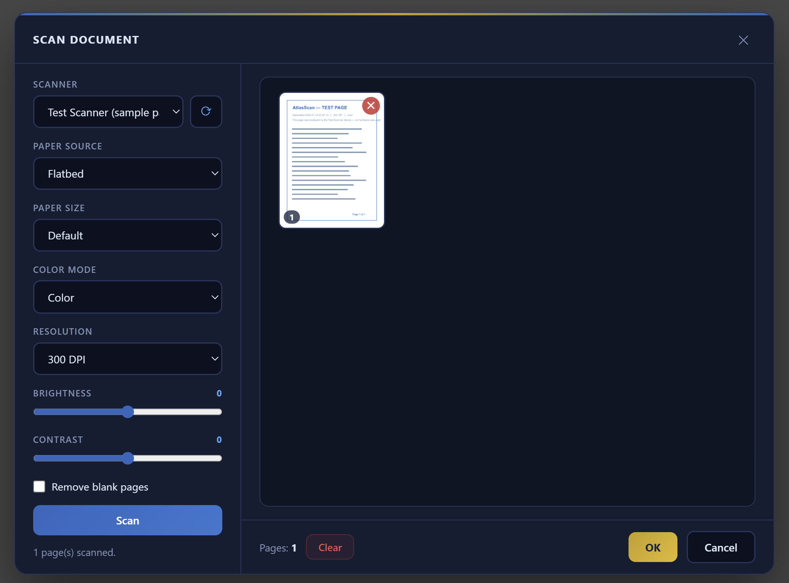

# AtlasScan — web scanning for any project

Drop-in replacement for Asprise Scanner.js, in two parts:

1. **`scan-service`** (sibling folder) — a small tray app (`AtlasScan.exe`)
   installed once per scanning workstation. Talks to scanners via Windows/WIA
   and serves `http://127.0.0.1:18990`.
2. **`atlasscan.js`**  — a single script any web page includes.
   It renders the scan dialog (scanner/source/size/color/DPI/brightness/contrast,
   page previews with click-to-enlarge, blank-page removal) and returns the
   scanned document as a PDF.

## 1. Workstation setup (once per PC that scans)

Copy the `scan-service` folder to the PC, then:

```
build.cmd              — compiles AtlasScan.exe (no SDK needed; uses Windows' built-in C# compiler)
AtlasScan.exe          — run it; a tray icon appears
install-autostart.cmd  — optional: start automatically at login
```

## 2. Web page integration

```html
<script src="atlasscan.js"></script>
```

```js
async function onScanClick() {
  const result = await AtlasScan.scan();

  if (!result) return; // user cancelled

  result.base64;     // base64 PDF (no data: prefix)
  result.dataUrl;    // "data:application/pdf;base64,..."
  result.blob;       // Blob — ready for upload
  result.pageCount;  // number of pages

  // typical upload:
  const fd = new FormData();
  fd.append('file', result.blob, 'document.pdf');
  await fetch('/your/upload/endpoint', { method: 'POST', body: fd });

  // …or save to the user's disk instead of uploading:
  const a = document.createElement('a');
  a.href = URL.createObjectURL(result.blob);
  a.download = 'document.pdf';
  a.click();
}
```

That's the entire API. Options (all optional):

```js
AtlasScan.scan({
  serviceUrl: 'http://127.0.0.1:18990', // where AtlasScan.exe listens
  theme: 'dark',                        // 'dark' | 'light'
  title: 'Scan Document',               // dialog header text
});

// health check without opening the dialog:
const up = await AtlasScan.isServiceAvailable(); // true/false
```



Notes:

- jsPDF is loaded automatically from jsDelivr the first time it's needed; to
  work fully offline, include jsPDF yourself before `atlasscan.js`.
- The dialog always lists a **"Test Scanner (sample pages, no hardware)"**
  device, so integrations can be tested with no scanner attached.
- Works from `http://localhost` pages and from `https` pages (browsers allow
  requests to `127.0.0.1` from secure pages). The service only accepts
  connections from the local machine.
- See `example.html` for a runnable demo.
